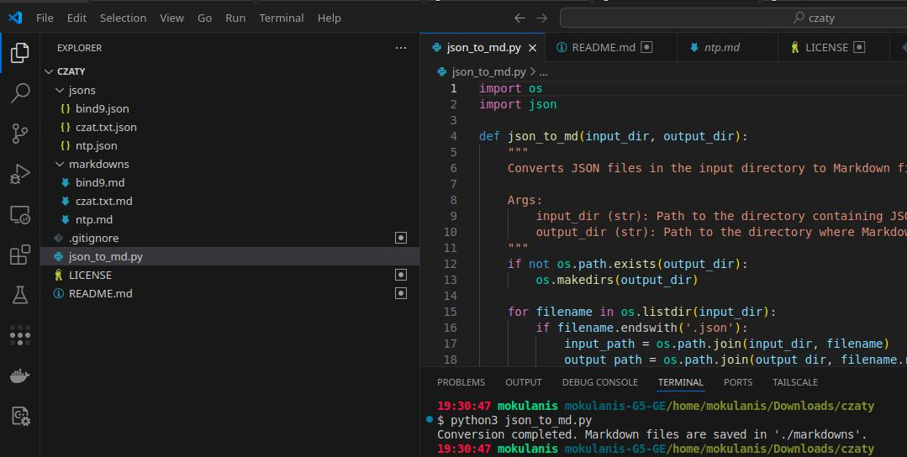

# Github Copilot Export JSON to Markdown Converter

This project provides a Python script to convert JSON files into Markdown (`.md`) files. It is designed to process JSON files exported from Copilot and generate human-readable Markdown documents.

## Author
- **Mateusz Okulanis** (2025)
- **Email**: FPGArtktic@outlook.com

## Features
- Converts JSON files in a specified input directory to Markdown files in an output directory.
- Extracts and formats relevant fields from JSON into Markdown syntax.
- Automatically creates the output directory if it does not exist.

## Project Structure
```
json_to_md.py       # Main script for JSON to Markdown conversion
jsons/              # Directory containing input JSON files
markdowns/          # Directory where output Markdown files are saved
```

## Requirements
- Python 3.x

## Usage
1. Place your JSON files in the `jsons/` directory.
2. Run the script:
   ```bash
   python3 json_to_md.py
   ```
3. The converted Markdown files will be saved in the `markdowns/` directory.



## Example
### Input JSON (`jsons/example.json`):
```json
{
    "requesterUsername": "user123",
    "requests": [
        {
            "message": {"text": "What is the weather today?"},
            "response": [
                {"value": "The weather is sunny."}
            ]
        }
    ]
}
```

### Output Markdown (`markdowns/example.md`):
```markdown
# Requester: user123

## Request: What is the weather today?

### Response:
The weather is sunny.
```

## Customization
You can modify the `convert_to_markdown` function in `json_to_md.py` to customize how JSON data is formatted into Markdown.

## License
This project is licensed under the GNU General Public License v3.0 (GPL-3.0). See the LICENSE file for details.

Copyright © 2025 Mateusz Okulanis (FPGArtktic@outlook.com)